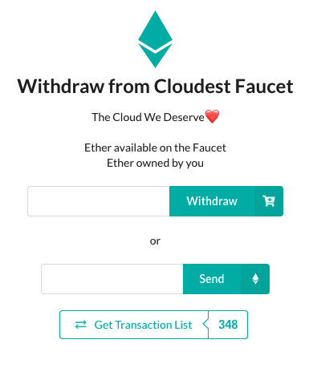

<h1> <a href="https://cloudest-9c004.web.app/">Cloudest</a>, <i>The Cloud We Deserve</i> </h1>

Introduction
============

  
Table of Contents

  
  - [Introduction](#introduction)
    - [The Problem](#the-problem)
    - [The Possible Solution](#the-possible-solution)
  - [The System Architecture](#the-system-architecture)
    - [Structure and General Schema](#structure-and-general-schema)
    - [Framework: Truffle Suite](#framework-truffle-suite)
    - [Core Contract Code: Solidity](#core-contract-code-solidity)
    - [Web Interfacing: Web3JS](#web-interfacing-web3js)
    - [Front-End e Browser Tools](#front-end-e-browser-tools)
    - [Blockchain](#blockchain)
    - [HTTP Gateway: Infura](#http-gateway-infura)
    - [P2P Storage: IPFS](#p2p-storage-ipfs)
  - [The Cloudest Development](#the-cloudest-development)
    - [Organization and Time Management](#organization-and-time-management)
    - [Time/Tasks Management and Development](#timetasks-management-and-development)
  - [The operation and use of Cloudest](#the-operation-and-use-of-cloudest)
    - [Start and “login”](#start-and-login)
    - [file/folder uploads](#filefolder-uploads)
    - [Download, Rename File and Add To Favorites](#download-rename-file-and-add-to-favorites)
    - [Move to Trash and Delete Definitively](#move-to-trash-and-delete-definitively)
    - [Favorite Files, Recent Files, Search and Filters](#favorite-files-recent-files-search-and-filters)
  - [FileDetailsManager.sol Smart Contract](#filedetailsmanagersol-smart-contract)
    - [Data Structures](#data-structures)
    - [Smart Contract Methods](#smart-contract-methods)
  - [Firebase](#firebase)
    - [References](#references)

The Problem
-----------

According to an article by SeedScientific, 2.5 quintillion bytes of data are produced every day. It should be noted that of the total data in the world, over 90% of the data was produced in the last 4 years. However, most of the data currently available through the Internet is "centralized", that is, archived by a very small number of technology companies that have the experience and capital to build huge data centers capable of handling these huge amounts of data. The fundamental problem of this approach is precisely the centrality of data. In fact, the latter are at the mercy of malicious people who can access, modify or even delete the data loaded in the data centers. When it comes to very large companies this is a very low risk, but another big problem is just around the corner. What is most important for a consumer is their privacy, which is very often jeopardized by third-party agencies that use the data uploaded for marketing and advertising purposes, often without the knowledge of consumers. Furthermore, the cost incurred for storing data in centralized servers is very high and has a great impact on the environment and many times end users have to pay for an archiving plan even if they only use a fraction of the space they actually bought. Another problem is system scalability: it is difficult to scale a centralized storage system to meet the growing demand.

The Possible Solution
----------------------

The platform that this paper aims to describe, Cloudest, attempts to solve the numerous technical, ethical and economic problems of the current centralized storage system.

The blockchain is in fact a decentralized cloud storage system that guarantees data security. Any processing node connected to the Internet can join and form a peer network, thus maximizing the use of resources. Each node on the network stores a copy of the blockchain thus making it immutable. In Cloudest, the user can upload a file to the platform which in turn sends the resource to the P2P IPFS network (*InterPlanetary File System*). As you will see below, IPFS uses a *hash* system to retrieve the files distributed in the network, Cloudest takes care of saving these hashes and making them available by saving them with all the necessary information on the blockchain.

The System Architecture
=========================

Structure and General Schema
---------------------------

Cloudest, reachable at the link <https://cloudest.cloud>, is a *decentralized application*, a structure also known as *DApp*, precisely *Decentralized Application*. The structure can be represented as shown in the figure.

A brief description of the main components is given below.

Framework: Truffle Suite
------------------------

*Truffle* is a test framework and resource pipeline for the blockchain that uses the *Ethereum Virtual Machine* (EVM), with the aim of *simplifying* life for developers. In fact, it provides a series of tools aimed at the migration of contracts on private and public networks and a series of tools for integration with Web Apps, in particular by interfacing with the Web3JS library.

Core Contract Code: Solidity
----------------------------

*Solidity* is a high-level language oriented to objects used for the implementation of *smart contracts*. Nello specific case of Cloudest, only one contract is used (see in the following) which deals with organizing through particular structures file details by associating them with individual users.

Web Interfacing: Web3JS
-----------------------

*Web3JS* is a library written entirely in Javascript which allows interaction, using appropriate tools, such as Metamask (see below), with the blockchain, in the case of Cloudest via HTTP. In fact once the command `truffle compile` is executed (specific command for compiling contracts of the suite of Truffle), a contract `json` file is created which Web3JS interprets, recalling for example specific functions of the contract from Javascript code.

Front-End e Browser Tools
-------------------------

### NodeJS/ReactJS

Cloudest uses as a *client* a Javascript application it uses NodeJS, specifically ReactJS to manage the part graphics. The purpose of React is to view the recovered data from the blockchain and from IPFS showing them to the user and providing the tools (buttons, textboxes, etc .) for interacting with the application and IPFS as well as with the blockchain.

### Metamask + Chrome

The development of Cloudest was oriented towards its use on Chrome, choice made considering above all the use of the extension *Metamask*, well integrated with Chrome. Metamask is in fact a wallet for Ethereum, which integrates perfectly with applications developed for example in javascript, and especially with Web3JS. Indeed provides an easy way to make the necessary transactions for the use of contracts and allows you to make a quick *switch* between different Ethereum networks.

Blockchain
----------

### Testing: Ganache

*Ganache* is a personal blockchain for the rapid development of Ethereum and Corda distributed applications. Ganache can be used throughout the development cycle, allowing you to develop, deploy and test DApps in a secure and deterministic environment.

### Public: Kovan

*Kovan* is a publicly accessible *Proof of Authority* (PoA) blockchain of Ethereum. This new testnet will use Parity (an Ethereum client developed by Parity Technologies, FKA Ethcore) to provide a stable and secure testnet environment for Ethereum developers. It was decided to use Kovan as a testnet and not better known networks such as ropsten given its stability and speed in processing new transactions.

HTTP Gateway: Infura
--------------------

*Infura* is a framework that provides various services both for interacting with the Ethereum blockchain (for example for the *deployment* of contracts on public networks, acting as *HTTP Provider*) or for interacting with IPFS (acting as from *Gateway*). In the case of cloudest Infura was used both to interact with IPFS and to deploy the contract on the *Kovan* network.

P2P Storage: IPFS
-----------------

*IPFS*, *Interplanetary File System* is an open source peer-to-peer distributed hypermedia protocol that aims to function as a file system for all connected computing devices. Its operation consists in dividing the files, which are assigned a unique identifier and a cryptographic hash, into blocks and distributed to the nodes of the network. Duplicates are removed across the network and version history is tracked for each file. This leads to permanently available content, furthermore, the authenticity of the content is ensured through this mechanism and, when a device searches for files, it essentially asks the network to find nodes that store the content behind the unique identification hash associated with that content.

The Cloudest Development
=======================

This section will show and mention the tools and technologies used for the development and management of the Cloudest project.

Organization and Time Management
--------------------------------

Cloudest development has been split into 3 major *milestones*.

### Milestone 1: Faucet

In the first, the development was centered on a simple application that acted as *Faucet* (a sort of "bank" for ethereum. A user can contact the Faucet in order to request a sum in Ether. It is a common tool, of course, only in testnets). From this application in particular you can also help provide funds to the Faucet. This first milestone was used to become familiar with the interaction with Metamask and with contracts on the blockchain. In the figure a screenshot of the application.

### Milestone 2: first integration with IPFS

The second milestone helped to get familiar with the *Infura + IPFS* system. In this simple application, the upload and download of a single file from the IPFS network was tested. A screenshot of the application is shown.

### Milestone 3: integration and development of the platform

The third and last milestone, as well as the most substantial, was aimed at developing the platform itself, as an integration of the two previous milestones and the various functions and writing of the contract.

Time/Tasks Management and Development
--------------------------------

### Time/Tasks Management

The *Microsoft Planner* platform was used to manage tasks, time, deadlines and in general for the organization of a rather complex project, a screenshot of which is shown in the figure.

### Development

To keep the written code safely, Github was used, a useful application for storing and versioning the code. For the development of the platform, Visual Studio Code was used entirely, chosen for its simplicity and ease of use, as well as for its functionality. In fact, to make it suitable for our use, some extensions have been added such as * Live Shere * useful for the simultaneous development of code in real time. With this extension it was also possible to share the development server (localhost) on all devices connected to the Live Share session, so as to be able to operate and view the code and its actual operation at the same time, as if it were a single computer.

Thanks to these tools it was possible to develop the entire platform entirely remotely.

The operation and use of Cloudest
=========================================

For each section, the operation of the platform is shown on the end user side (Foreground) and on the platform side, with technical details on the operation (Background).

Start and “login”
---------------

### Foreground

When the user goes to <https://cloudest.cloud> this is the screen that is presented to him.

If everything works correctly, Metamask offers the user to log in and unlock the wallet, so as to allow the application to access the latter. If everything works correctly again, the user is shown the actual application page, a screenshot of which is shown in the figure.

### Background

What happens "behind the scenes" is what allows Metamask and the React application to communicate. Through a particular function (`getWeb3 ()`), the Javascript object `web3` is retrieved from the` window` object. This object is provided directly by Metamask and allows to communicate with the Web3JS library.

file/folder uploads
--------------------------

### Foreground

By clicking on the "File +" button, the user can upload a file from the popup that is shown. Once the upload to IPFS has been confirmed, the Metamask popup is shown to the user asking for confirmation of the transaction. In the figure you can see a screenshot of the upload functionality.

The procedure for creating a folder is almost identical to that of uploading a file.

### Background

As for the file upload, two main functions are called. With the first the file is uploaded to the IPFS network. This function then returns the identification hash of the file, which is loaded together with all the information on the blockchain by the second function called.

Folders are treated by the smart contract just like a file, but its type is `folder`. The system of folders and subfolders has been implemented by adding a `parentFolder` attribute to each file and each folder, so that it is possible to reconstruct *on demand* the tree structure of the filesystem, also allowing deletion *recursive* of the files and subfolders that contain them.

The file, or rather its buffer, is encrypted before being uploaded to the IPFS network using the *AES-256* algorithm using the 32-byte hash of the user's wallet address obtained through the encryption key. 'hashing algorithm *keccak256*.

Download, Rename File and Add To Favorites
---------------------------------------

### Foreground

By pressing in "action", a link visible in each file and folder, the user has access to functions such as downloading the item, renaming it or adding favorites. In the figure you can see a screenshot of the download, rename and add to favorites functions.

### Background

When the user clicks on "Download", the file buffer is recovered from the IPFS network via the hash of the aforementioned file to be decrypted. At this point the file is downloaded using the `fileDownload ()` function with all the relative information (such as name and extension) retrieved from the contract. Both in the case of "Rename" and in the case of "Add/Remove to Favorites", there is a reference to a specific function of the contract that is responsible for changing the file attributes as needed. The contract and its structure will be explored below.

Move to Trash and Delete Definitively
-----------------------------------

### Foreground

When you want to delete a file, the user must first move it to the trash. Within it, you can choose whether to permanently delete the file/folder or recover it and bring it back to its original location. In the figure you can see a screenshot of the delete functions.

### Background

As mentioned above, the foldering system is based on the concept of *parent folder*, so as to be able to perform, if necessary, a recursive deletion. In fact, there is a particular method in the contract that will be explored later, in which the files are recursively moved to the trash or permanently deleted. It should be noted that if you move a folder to the trash every file and folder inside it will be moved to the trash, to eventually be moved to the root folder if recovered from the trash. This therefore implies that the structure of folders and subfolders is maintained only if an entire folder is moved to the trash.

Favorite Files, Recent Files, Search and Filters
----------------------------------------------

### Foreground

The user can, using the buttons in the side navigation bar, move between the page that contains all the folders, subfolders and files by clicking on "Files and Folders", or move to the "Favorites Files" pages, which shows the files marked as *favorite*, and "Recent Files". On this page it is possible to view through appropriate filters the files uploaded in the last hour, the current day, the last week or the last month.

Various filters have also been implemented in the "Files and Folders" page, thus giving the user the ability to view only certain types of files or sort them by date or name (increasing or decreasing).

The search function has also been implemented (also accessible from the sidebar), which allows you to search for any type of file by its name, in all folders and subfolders.

### Background

All the above functionalities have been realized through the React functions. In particular, the concept of *state*, characteristic of React components, was used throughout the development, which allows you to store data (eg the current folder in which the user is located), update and modify them, thus triggering certain actions . The use of these mechanisms has made it possible to create a so-called *single-page application*, in *real-time* (ie without the need to update the page to re-establish the connection with Node, in fact maintaining a constant connection).

FileDetailsManager.sol Smart Contract
===================================

*FileDetailsManager* is the core of the whole platform. As mentioned in the previous sections, *FileDetailsManager* is a *smart contract* whose fundamental purpose is to manage, by storing and modifying them, the data of individual Cloudest users. These *data* are not personal data (remember that the purpose of the platform is also to keep the password), but the details of the files that users upload to the "cloud" via Cloudest.

Data Structures
--------------

### “FileDetails” Structure

The details of each individual file are saved in a particular data structure (a `struct`), formed as follows:

        struct FileDetails {
            string uniqueId; //unique id of the folder or the file's IPFS fileHash
            string name; // folder's name or file's name
            string transactionDate; // The date in which file's info was stored
            string fileType; // "folder" if folder otherwise the extension of the file
            string parentFolderId; // parent folder id (both for files and folders)
            bool isFavorite; // true if favorite, false otherwise
            bool isTrash; // true if currently in the trash, false otherwise
        }

As you can see, each "file" is associated with its hash relating to IPFS, while each folder (which is assumed to have the same names) is associated with a unique address. This is calculated using a counter which is incremented each time a folder is created.

### Mapping wallet -> fileDetails

As mentioned above, each user, or rather each *wallet* that interacts with the contract by adding files, is assigned an array containing all the details of all the files added. To do this we used a data structure called `mapping`, as follows:

        mapping(address => FileDetails[]) filesList;

Smart Contract Methods
------

### AddFile

        function addFile(string memory uniqueId, 
                     string memory name, 
                     string memory fileType, 
                     string memory date, 
                     string memory parentFolderId) 

This method is used to add a file to the file array of a specific *wallet*, with the data specified in the parameters.

### AddFolder

        function addFolder(string memory name, 
                           string memory date, 
                           string memory parentFolderId) 

This method is used to add a folder to the array of a specific *wallet*, with the data specified in the parameters.

### deleteFile

        function deleteFile(string memory uniqueId,     
                            string memory name) 

Questo metodo rimuove uno specifico file dall’array di file di uno
specifico *wallet*.

### deleteFolder

        function deleteFolder(string memory uniqueId)

This method allows the deletion of a folder and, recursively, the deletion of all the files and folders within it.

### getFiles

        function getFiles() returns (FileDetails[]) 

This method returns the array containing files and folders of a specific *wallet*

### renameFileName

        function renameFileName(string memory uniqueId, 
                                string memory name, 
                                string memory newName)

This method allows you to rename a specific file of a specific *wallet*.

### setFavorite

        function setFavorite(string memory uniqueId, 
                             string memory name, 
                             bool isFavorite)

This method allows you to set a new value for the `isFavorite` field of a specific file of a specific *wallet*.

### setTrashFile

        function setTrashFile(string memory uniqueId, 
                              string memory name, 
                              bool isTrash, 
                              bool isSingleDelete)

This method allows you to set a new value for the `isTrash` field of a specific file or wallet.

### setTrashFolder

        function setTrashFolder(string memory uniqueId, 
                                bool isTrash, 
                                bool isSingleDelete)

This method allows you to set a new value for the `isTrash` field of a folder and recursively for all subfolders and the files they contain.

Firebase
========

Cloudest can be reached from the link <https://cloudest.cloud>. To make it public, the *Firebase* platform was used, a platform for creating and managing applications for mobile and web devices developed by Google.

## References ##

SeedScientific Article,
<https://seedscientific.com/how-much-data-is-created-every-day>, *How
Much Data Is Created Every Day?*, Branka Vuleta, 28 Gen - 2021.

Truffle Suite, <https://www.trufflesuite.com/>, ConsenSys Software Inc.

Solidity Language, <https://soliditylang.org/>, Solidity Team

Web3JS, <https://github.com/ChainSafe/web3.js>, *Ethereum Javascript
API*, ChainSafe

NodeJS, <https://nodejs.org/>, OpenJS Foundation

ReactJS, <https://reactjs.org/>, Facebook Inc.

Metamask, <https://metamask.io/>, Metamask, a ConsenSys Formation

Ganache, <https://www.trufflesuite.com/ganache>, ConsenSys Software Inc.

Kovan Testnet, <https://kovan-testnet.github.io/website/>, Parity
Technologies

Infura, <https://infura.io/>, Infura Inc.

IPFS, <https://ipfs.io/>, Protocol Labs

Microsoft Planner,
[https://www.microsoft.com/](https://www.microsoft.com/en-ww/microsoft-365/business/task-management-software),
Microsoft

Visual Studio Code, <https://code.visualstudio.com/>, Microsoft

Firebase, <https://firebase.google.com/>, Google Developers, Google
